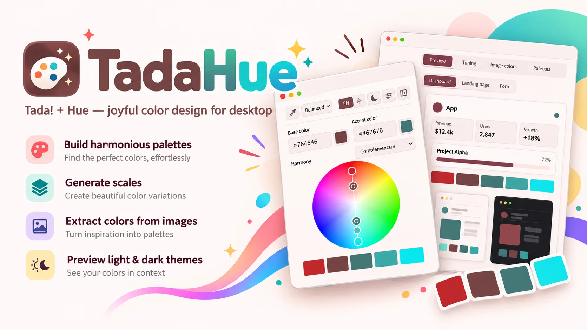

# TadaHue

<div align="right">
  <a href="./docs/README-TW.md">繁體中文</a>
</div>

A desktop color toolkit for creating palettes, exploring color harmonies, and previewing themes.



## Features

- Explore color harmonies with a draggable five-color wheel.
- Generate 50–950 color scales and complementary, analogous, monochromatic, split-complementary, triadic, and shade palettes.
- Tune hue, lightness, and chroma in OKLCH; choose balanced, pastel, or vintage styles.
- Preview light and dark themes in dashboard, landing-page, and form layouts.
- Extract up to five colors from PNG, JPEG, WebP, and GIF images. Image processing stays on your device.
- Save up to 20 palettes locally and copy CSS, Tailwind configuration, or JSON.
- Pick colors from anywhere on screen with the desktop eyedropper.

## Desktop support

| Platform | Package                    | Screen eyedropper                                             |
| -------- | -------------------------- | ------------------------------------------------------------- |
| Linux    | AppImage                   | X11 capture or Wayland screenshot portal                      |
| Windows  | NSIS installer or portable | Electron screen capture                                       |
| macOS    | DMG                        | Electron screen capture; Screen Recording permission required |

See [platform support](docs/PLATFORM_SUPPORT.md) for permission details and Linux display options.

## Help test Windows and macOS

Only the Linux AppImage has been tested so far. I do not have Windows or macOS machines available, so the Windows and macOS package formats listed above have not yet been tested.

If you have access to either platform and would like to help, contributions to building and testing the desktop app are welcome. See the development and build commands below to get started.

Please share your results through [GitHub Issues](https://github.com/taosaunter/tadahue/issues), whether the app works or you encounter a problem. Useful details include:

- Your operating system version, CPU architecture, and the TadaHue version or commit tested.
- Whether building, installing, and launching the app work.
- Whether screen picking and its permissions, image color extraction, palette saving, and CSS/Tailwind/JSON export work.
- For problems, steps to reproduce, expected and actual behavior, and relevant error messages or screenshots.

Even a brief report helps. Thank you for helping improve platform support!

## Privacy

TadaHue has no analytics, telemetry, crash reporting, accounts, or cloud sync. Image extraction and saved palettes stay on your device.

## Development

Requires Node.js and pnpm.

```bash
pnpm install
pnpm dev             # Start the browser development server
pnpm electron:dev    # Launch the desktop app
```

## Build and checks

```bash
pnpm build
pnpm electron:build
pnpm lint
pnpm test
pnpm verify:theme
```

Build Windows and macOS packages on a matching machine or CI runner.

## License

TadaHue is licensed under the MIT License. Linux Wayland support uses `@homebridge/dbus-native`; see [third-party notices](./docs/THIRD_PARTY_NOTICES.md) for its dependency licenses.
